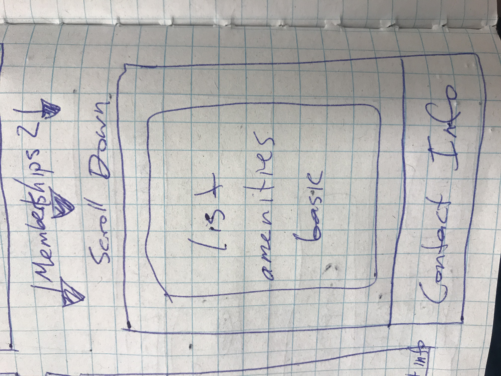
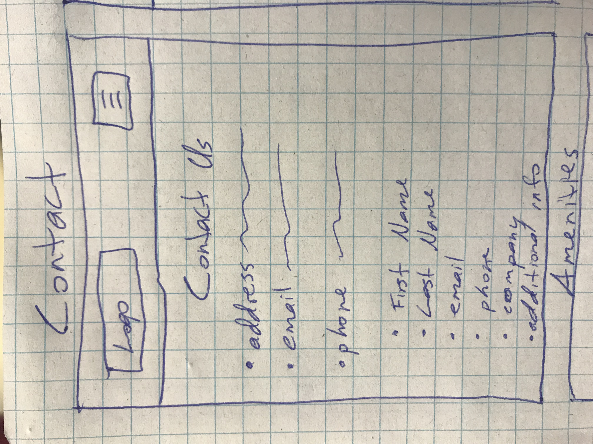
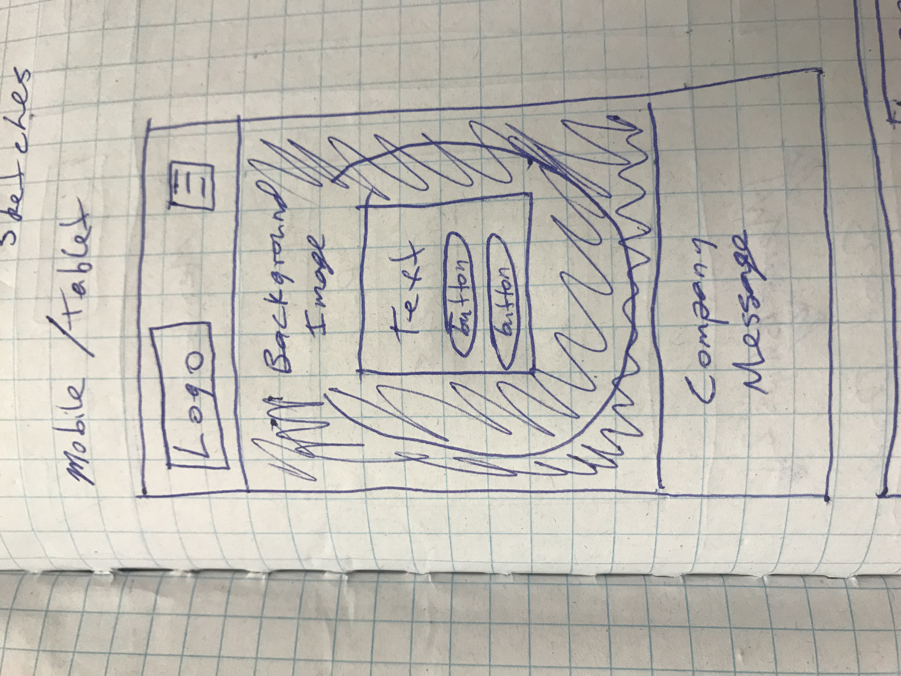
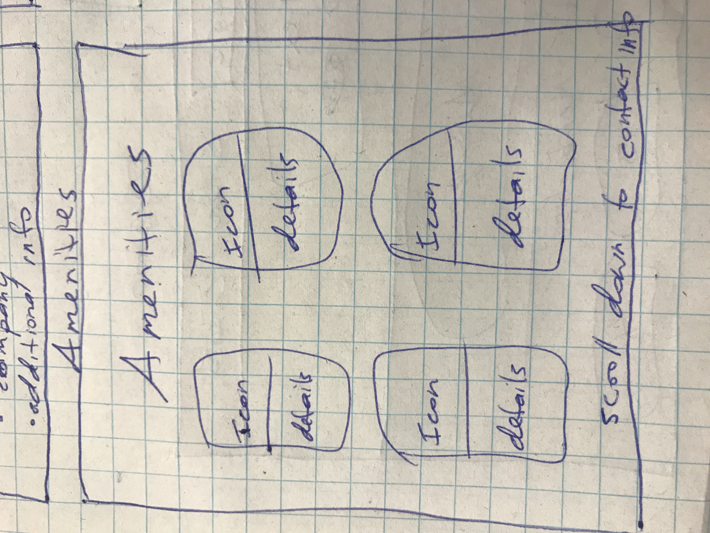
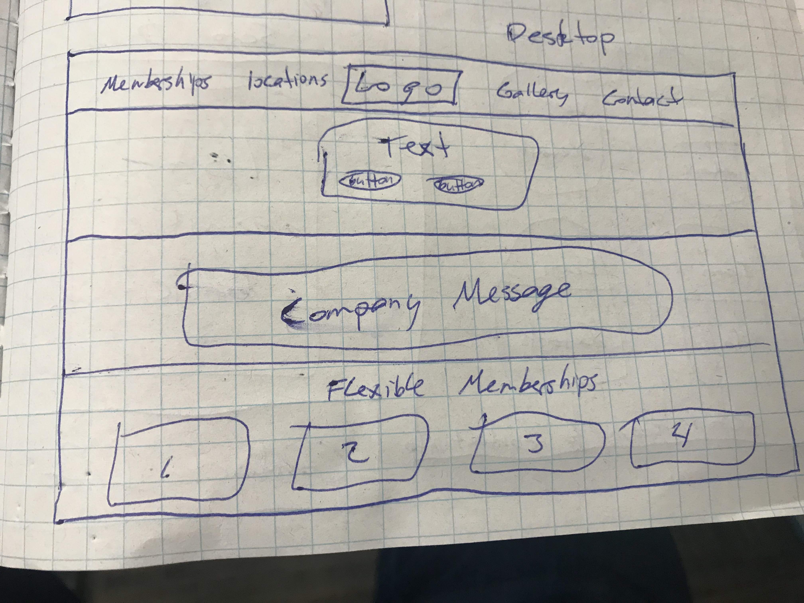
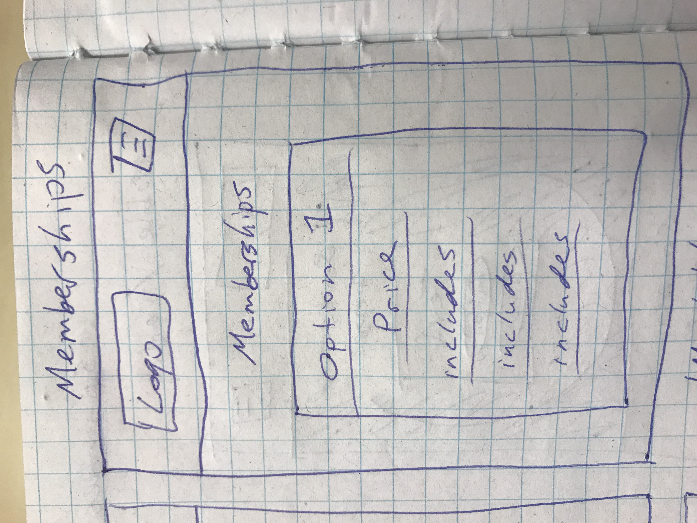

# _Freelance Coworking Contract_

#### _{Brief description of application}, {Date of current version}_

#### By _**{List of contributors}**_

## Description

_This project is a website for a new co-working company that has come to town. This website displays everything about the companies workspace, including, contact information, included amenities, cost, subscription and membership model, and how to join the workspace._

## User Personas

* _Freelancers_
  * _Offers a space other than their home to avoid distractions, focus, and be productive while working_
  * _Allows them to work in the same environment as other people in the same field of work to spark creativity and improve networking_
  * _Although they will work here to avoid distractions at home, others will be around so they wont feel isolated_
  * _The space comes with many amenities such as, fast wifi, a designated mailing address, colored printers_
* _Start-Up Companies_
  * _The space comes with many amenities such as, fast wifi, a designated mailing address, colored printers_
  * _Allows excellent flexibility and low risk for a changing business because it is less risky than obtaining an office space and diverse enough to accommodate expansion_
  * _Other creative minds will be using the space which is perfect for product testing, creative assistance, and networking_
* _Travelers_
  * _Provides a professional environment to complete work_
  * _The space comes with many amenities such as, fast wifi, a designated mailing address, colored printers_
  * _Excellent for networking while on the move_
* _Students_
  * _Provides a space to practice working in a professional setting and network for the future_
  * _The space is cheap and comes with many amenities such as, fast wifi, a designated mailing address, colored printers_

## Sketches
        

## Setup/Installation Requirements

* _This is a great place_
* _to list setup instructions_
* _in a simple_
* _easy-to-understand_
* _format_

_{Leave nothing to chance! You want it to be easy for potential users, employers and collaborators to run your app. Do I need to run a server? How should I set up my databases? Is there other code this app depends on?}_

## Known Bugs

_{Are there issues that have not yet been resolved that you want to let users know you know?  Outline any issues that would impact use of your application.  Share any workarounds that are in place. }_

## Support and contact details

_{Let people know what to do if they run into any issues or have questions, ideas or concerns.  Encourage them to contact you or make a contribution to the code.}_

## Technologies Used

_{Tell me about the languages and tools you used to create this app. Assume that I know you probably used HTML and CSS. If you did something really cool using only HTML, point that out.}_

### License

*{Determine the license under which this application can be used.  See below for more details on licensing.}*

Copyright (c) 2016 **_{List of contributors or company name}_**
